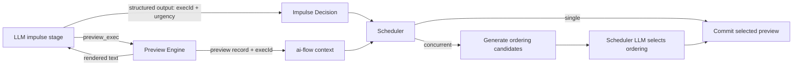
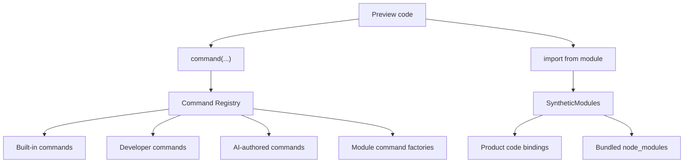
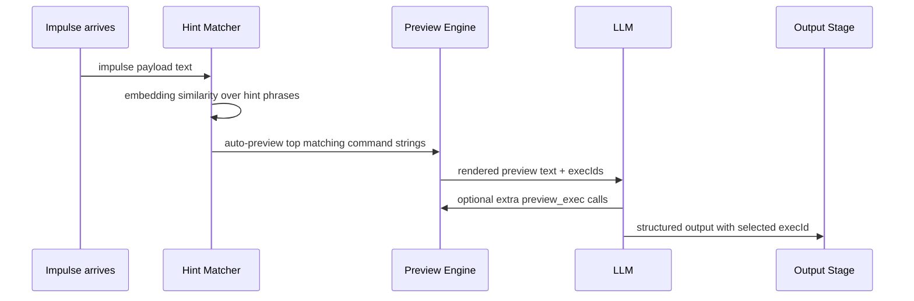
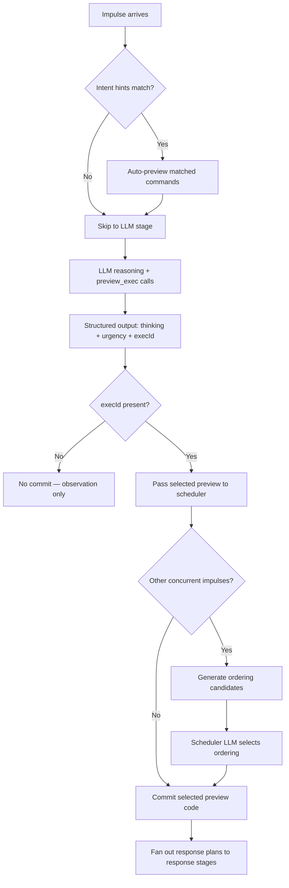
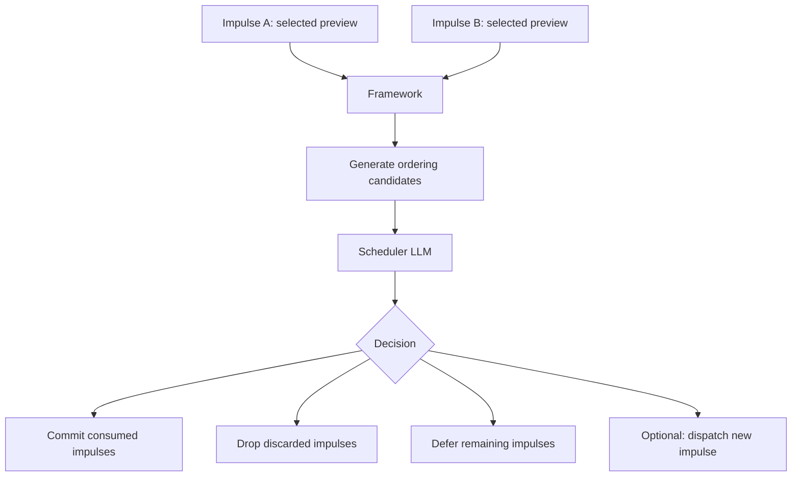

# ai-construct Command Computer Spec

> v2 — Preview/Commit model. Supersedes v1 (exec-only model).
> See `command-computer-overview.md` for the usability-focused summary.

---

## 1. Overview

An ai-construct is an AI persona backed by a **computer** — a persistent
Linux-like environment the AI can read, write, run code on, and accumulate
capability in over time. Every impulse runs on the same computer.

The AI has **one tool: `preview_exec`**. It writes TypeScript that runs on a
**forked** world — nothing commits. The AI can call `preview_exec` multiple
times to explore, test, and draft. Each preview produces an `execId`. The
impulse stage's structured output selects one `execId` to commit. The
scheduler later commits the selected preview against real state.



The system has three layers:

```
ai-flow              generic LLM primitives (createPreviewExecTool, OverlayFs)
ai-sandbox-computer  the computer (command registry, preview engine, sys modules)
ai-construct         the persona (impulse lifecycle, scheduler, intent hints, nap/hypno)
```

ai-construct calls into ai-flow. ai-flow has no knowledge of ai-construct.

---

## 2. Terminology

| Term | Definition |
|---|---|
| **`preview_exec`** | The AI's single tool. Runs TypeScript on a forked world. Returns rendered text to the LLM + stores a preview record in ai-flow context. |
| **preview record** | The full artifact from a `preview_exec` call: `execId`, code, stdout, response plans. Stored hidden from the LLM in ai-flow flow context. |
| **`execId`** | Stable identifier for a preview record. The LLM selects one in structured output. |
| **selected preview** | The preview record chosen by the impulse structured output's `execId`. The scheduler commits this. |
| **command** | A registered operation (read, write, list, etc.) invoked via the `command()` function. `command()` writes readable lifecycle output to stdout (start, then rendered result or error) and returns the raw result. |
| **command handler** | The function that implements a command. Registered via `defineCommand`. |
| **command registry** | The map of command names → handlers. Three tiers: built-in, developer, AI-installed. |
| **code binding** | A typed product API function imported as an ESM module. Defined via `defineCodeBinding` / `.tool.ts`. |
| **`show()`** | Global that explicitly pretty-prints a value and returns it. For command-tagged values, it uses the command's `render`. |
| **`plan_response()`** | Global that proposes a user-facing response plan. Not sent immediately — the response stage crafts the final wording, the scheduler decides delivery. |
| **lane** | A named processing pipeline that determines context isolation, log routing, and scheduler behavior for an impulse. Lanes are implicit — any impulse can specify any lane name. |
| **intent hint** | A TOML entry mapping a natural-language phrase to a concrete command invocation. Auto-previewed at impulse start. |
| **prompt window** | Tokens the LLM is actively reasoning over. |
| **flow state** | Typed TypeScript object ai-flow maintains across stages. |
| **host context** | Server-side `{ deps, fs, ctx, input }` passed to CodeFunction implementations. `deps` are invocation-scoped and may be tx-bound. |
| **transaction cycle** | One top-level request / invocation lifecycle that opens a DB transaction, binds invocation-scoped deps, runs handlers, then commits or rolls back. |
| **effect context** | Invocation-scoped fire-and-forget effect collector. Handlers call effects immediately for preview text, but real delivery only happens after commit succeeds. |
| **construct memory** | Everything persisted in the VFS. |
| **impulse payload** | Structured or unstructured data that triggered an impulse. |

---

## 3. Package Boundaries

### `@inkibra/ai-flow`

Generic LLM pipeline primitives. No knowledge of constructs, computers,
commands, or intents.

**Owns:**
- `createAiFlow`, `createAiOutputStage`, `createAiTextStage` — flow builder
- `createPreviewExecTool` — the single AI tool factory
- **Two tool kinds:** JSON-schema function tools (existing) and **text-input
  custom tools** (new — required for `preview_exec`). OpenAI Responses API
  supports custom tools with free-form text inputs and outputs. ai-flow needs
  to expose this alongside the existing function-tool path.
- Hidden preview record storage in flow context (per-stage `previewExecRuns` map)
- `OverlayFs`, `createOverlayFs` — VFS layer
- `CodeFunction`, `codeFunction()`, `defineCodeBinding` — product binding types
- `.tool.ts` build-pack plugin — generates validators and declarations
- OpenAI streaming orchestration (`flow.ts`)

**Does not own:** command registry, defineCommand, sys modules, preview engine,
ts-pm, router transaction cycles, effect contexts, intent hints, impulse
lifecycle, scheduler.

---

### `@inkibra/ai-sandbox-computer` _(new package)_

The computer abstraction. Can be used independently of ai-construct.

**Owns:**
- `CommandRegistry` — the command map (built-in + developer + AI-installed)
- `defineCommand` — the universal command definition interface
- All built-in command handlers (read, write, list, search, open, cron, pm, etc.)
- Preview engine — `vm.SourceTextModule` on a forked OverlayFs plus a router
  transaction cycle for DB-backed product APIs
- `sys` SyntheticModule — exports `command()` for use inside preview code
- `sys/ai` SyntheticModule — lightweight LLM SDK (extract, search, generate)
- Node built-in proxy SyntheticModules (node:fs, node:path, etc.)
- `show()` global — explicit pretty-print helper; uses command `render` when available, return raw value
- `plan_response()` global — propose user-facing response
- `createComputer(overlayFs, config)` — assembles registry + engine
- `defineAiComputerModule()` — groups static code bindings, typed deps, dependencies, and command adapters
- `createAiModuleDeps()` — typed per-invocation deps factories for AI modules
- `createEffectModule()` — typed effect contracts with preview text + host handler registration
- Router execute-context mapping callback for AI invocations

**Does not own:** HTTP backend request lifecycle, route definitions, context
codecs, workflow runtime internals, impulse lifecycle, intent hints, scheduler.

---

### `@inkibra/router`

Typed routes, handler/provider abstraction, context codecs, and the shared
transaction-cycle interface used by both HTTP backends and ai-computer.

**Owns:**
- `createAPIRoute`, `defineRouteSchema`, `defineContextSchema`
- `createApiRouteHandler` and provider-friendly handler typing
- Transaction-cycle interface for one request / invocation lifecycle
- Side-effect interface / effect context contract
- Route metadata for preview-safe vs preview-unsafe exposure

**Does not own:** concrete DB driver implementation, DAL collection factories,
workflow persistence, construct scheduling.

---

### `@inkibra/dal-connection`

Database driver layer. Implements the router transaction-cycle interface for
DB-backed runtimes.

**Owns:**
- `Driver` and transaction primitives
- Transaction-cycle implementation for supported drivers
- Tx-bound driver wrapper used to instantiate DAL collections per invocation

**Does not own:** route definitions, effect dispatch semantics, construct logic.

---

### `@inkibra/denzel-bun`

HTTP backend layer. Uses `TransactionRuntime` to open one request-scoped
transaction cycle and exposes it through AsyncLocalStorage helpers.

**Owns:**
- Request lifecycle wrapper around `transactionRuntime.begin({ mode: 'http' })`
- AsyncLocalStorage access to the current request transaction cycle
- Commit / rollback at the HTTP request boundary

**Does not own:** DAL collection factories, effect contract definitions, AI
preview runtime.

---


### `@inkibra/workflow`

Durable deferred work. Used as an effect target after commit, not as inline
preview-time external execution.

**Owns:**
- Workflow runtime / scheduler / queue system
- Durable workflow start APIs
- Retry / resume semantics for external work

**Does not own:** request transaction lifecycle, inline handler side effects.

---

### `@inkibra/ai-construct`

The persona layer. Uses ai-sandbox-computer as its computer. Calls into
ai-flow for LLM reasoning.

**Owns:**
- Impulse lifecycle (`runner.ts`, `flow.ts`, `construct.ts`)
- Intent hint registry (TOML), similarity matching, auto-preview of hints
- Impulse structured output schema (`thinking`, `urgency`, `execId`)
- Scheduler: commit of selected previews, ordering candidate generation,
  concurrent ordering selection
- Nap and hypno flows
- Response delivery based on `plan_response()` proposals + `urgency`
- Per-impulse auth/context assembly passed into ai-computer execute-context
  mapping

---

## 4. VFS Layout

The construct's filesystem follows Linux conventions. The AI uses standard
paths. Path semantics are enforced by OverlayFs permission layers.

```
/
├── usr/
│   ├── lib/
│   │   └── node_modules/     system modules (product bindings + bundled npm)
│   │       ├── workout-api/
│   │       │   ├── index.d.ts   AI reads this for type discovery
│   │       │   └── package.json
│   │       ├── zod/             pre-installed (esbuild bundle)
│   │       └── date-fns/        pre-installed (esbuild bundle)
│   └── share/
│       └── construct/
│           └── capabilities.d.ts   type declarations for system modules
├── home/
│   └── user/
│       ├── context/          AI's working memory (documents, state, notes)
│       │   └── state/        well-known state files (scheduler reads these)
│       ├── scripts/          AI-authored scripts and in-progress packages
│       └── .local/
│           ├── lib/
│           │   ├── node_modules/  agent-authored ts-pm packages
│           │   │   └── @commands/ AI-installed commands
│           │   │       └── streak-check/
│           │   └── intents/
│           │       └── registry.toml   intent hint registry (see §18)
│           └── bin/          AI-created executable scripts
├── var/
│   ├── lib/
│   │   └── ts-pm/
│   │       └── registry/     immutable published ts-pm packages
│   │           └── <pkg>/<version>/
│   ├── log/                  structured logs
│   └── spool/
│       └── cron/             scheduled impulses and reminders
├── etc/                      system configuration (AI read-only)
│   └── construct.md          construct identity and instructions
├── proc/
│   ├── self/
│   │   └── ctx               current flow state (readable by AI)
│   ├── meminfo               construct memory stats (file count, bytes, dirty)
│   ├── contextinfo           context window token budget
│   └── loadavg               active impulse count
└── tmp/                      ephemeral scratch space (cleared between naps)
```

**Write permissions:**
- AI can write anywhere under `/home/user/`
- AI can write to `/var/spool/cron/` (cron entries), `/var/log/` (append only)
- `/usr/`, `/etc/`, `/proc/` are read-only to AI
- `/tmp/` is writable but ephemeral

---

## 5. The `preview_exec` Tool

### 5.1 Schema

The AI's single tool during the impulse stage:

```typescript
{
  name: 'preview_exec',
  type: 'custom',            // text-input tool, not JSON-schema function tool
  description: '...',        // auto-generated from command registry + bindings
}
```

`preview_exec` accepts a **TypeScript program as raw text** — not a JSON
object with a `code` field. The model writes code directly as the tool input.

This requires ai-flow to support **custom / text-input tools** alongside the
existing JSON-schema function tools. The OpenAI Responses API supports custom
tools with free-form text inputs and outputs. If a specific provider does not
support custom tools, ai-flow may fall back to wrapping the input as
`{ code: string }` — but this is a transport detail, not the conceptual API.

One tool. Raw text input. **Nothing commits.**

### 5.2 What Happens on Each Call

1. Code is transpiled (TypeScript → JS via `Bun.Transpiler`)
2. A top-level **transaction cycle** is opened for DB-backed product APIs
3. Code runs on a **forked OverlayFs** — VFS writes are visible within the
   preview but do not affect real state
4. Code bindings call router-style handlers/providers using invocation-scoped
   deps built from the tx-bound driver and effect context
5. All `command()` calls work normally against the forked VFS and
   automatically write readable lifecycle output to stdout (start, then
   rendered result or error)
6. `show()` and `console.log` output is also captured as stdout
7. `plan_response()` proposals are captured in the preview record
8. Effect calls return preview text immediately, but are only staged in the
   effect context
9. The preview engine produces a `PreviewExecRecord` with an `execId`
10. The transaction cycle always rolls back at the end of the preview

### 5.3 Two Consumers

`preview_exec` serves two audiences simultaneously:

**The LLM** receives rendered text to continue reasoning:

```
Current streak: 12 days
Preview: log-workout would succeed
Draft response: "Logged your squats! Streak: 13 days."

[exec_id: prev_01HXYZ]
```

**ai-flow context** receives the full preview record, stored hidden from the
LLM in `ctx.previewExecRuns[execId]`.

This split uses ai-flow's existing tool architecture: `render()` produces
text for the model, `execute()` mutates flow context with the full record.

### 5.4 Tool Description

The tool description sent to the LLM includes:
- List of available commands with signatures and descriptions (auto-generated
  from the command registry)
- List of available product binding modules with their declarations
- Note that `command()` auto-shows lifecycle output; `show()` is for explicit
  rendering of existing values; `plan_response()` proposes user-facing text
- Note on `sys/ai` availability and budget
- Reminder that previews do not commit — the structured output selects one

### 5.5 `createPreviewExecTool`

```typescript
// ai-flow — uses the new text-input / custom tool kind
export function createPreviewExecTool<TFlowCtx extends Record<string, unknown>, TDeps>(
  options: PreviewExecToolOptions,
): AiCustomTool<TFlowCtx, string, PreviewExecRecord, TDeps> {
  return createAiCustomTool('preview_exec', {
    description: generatePreviewExecDescription(options),
    parseInput: (raw: string) => ({ success: true, data: raw }),
    execute: async (code, ctx, deps) => {
      const record = await options.engine.preview(code);
      // Store in hidden flow context
      ctx.previewExecRuns = ctx.previewExecRuns ?? {};
      ctx.previewExecRuns[record.execId] = record;
      ctx.previewExecOrder = ctx.previewExecOrder ?? [];
      ctx.previewExecOrder.push(record.execId);
      return { success: true, data: record };
    },
    render: (record) => {
      const parts = [];
      if (record.stdout) parts.push(record.stdout);
      if (record.responsePlans.length > 0) {
        parts.push('Draft responses:');
        for (const r of record.responsePlans) {
          parts.push(`  [${r.importance ?? 'normal'}] ${r.text}`);
        }
      }
      parts.push(`\n[exec_id: ${record.execId}]`);
      return parts.join('\n');
    },
  });
}
```

`createAiCustomTool` is the new ai-flow factory for text-input tools. It
differs from `createAiTool` in that it has `parseInput(raw: string)` instead
of `parameterSchema` + `parseParameters`. ai-flow serializes it as a custom
tool in the provider request, falling back to a single-field function tool
if the provider does not support custom tools.

---

## 6. Preview Record Model

### 6.1 Shape

```typescript
type PreviewExecRecord = {
  execId: string;                    // stable identifier, e.g. 'prev_01HXYZ...'
  code: string;                      // the TypeScript source that was previewed
  stdout: string;                    // captured command lifecycle, console.log, and show() output
  responsePlans: ResponsePlan[];   // captured plan_response() calls
  effectPreviews: string[];          // preview text returned by staged effects
  createdAt: string;                 // ISO timestamp
};

type ResponsePlan = {
  text: string;
  importance?: 'low' | 'normal' | 'high' | 'urgent';
};
```

### 6.2 Storage in ai-flow Context

Preview records are stored in the flow context, hidden from the LLM:

```typescript
type ImpulseFlowContext = {
  impulse: Impulse;
  decision: ImpulseDecisionOutput | null;
  previewExecRuns: Record<string, PreviewExecRecord>;
  previewExecOrder: string[];   // insertion order for debugging
};
```

The LLM only sees the rendered text from `preview_exec`. The full records
are available to ai-construct after the output stage completes, for passing
to the scheduler.

### 6.3 Multiple Previews

The AI can call `preview_exec` multiple times in one impulse. Each call
gets its own `execId`. The AI explores, tests, iterates — then picks the
best one. Only the selected preview is committed.

---

## 7. Impulse Structured Output

### 7.1 Schema

The impulse stage uses `createAiOutputStage` with:

```typescript
type ImpulseDecisionOutput = {
  thinking: string;
  urgency: 'none' | 'defer' | 'low' | 'normal' | 'urgent' | 'now';
  execId: string | null;
};
```

- **`thinking`**: Short internal note (max ~280 chars). Used for nap analysis.
- **`urgency`**: Stage-level routing hint for the scheduler / response stage.
- **`execId`**: References a preview record from `ctx.previewExecRuns`. If
  `null`, no program is committed (the impulse was observation-only).

### 7.2 Validation

After the output stage, ai-construct validates:
- If `execId` is non-null, it must exist in `ctx.previewExecRuns`
- If not found, the impulse fails with a clear error

### 7.3 What Gets Passed to the Scheduler

```typescript
{
  impulseId: string;
  thinking: string;
  urgency: string;
  selectedPreview: PreviewExecRecord | null;  // resolved from execId
}
```

---

## 8. Command Registry & `defineCommand`

### 8.1 `defineCommand` Interface

```typescript
type ArgDef = {
  type: 'string' | 'number' | 'boolean';
  position?: number;         // positional arg index (0-based)
  flag?: string;             // e.g. '--head', '--format'
  required?: boolean;        // default false
  default?: string | number | boolean;
  description?: string;
};

type CommandContext = {
  fs: OverlayFs;
  registry: CommandRegistry;  // call other commands
  deps?: unknown;             // developer-provided deps (for developer commands)
};

type Command<TResult = unknown> = {
  name: string;
  description: string;
  args: Record<string, ArgDef>;
  fn: (parsed: Record<string, unknown>, ctx: CommandContext) => Promise<TResult>;
  render: (result: TResult) => string;
};

function defineCommand<TResult>(opts: {
  name: string;
  description: string;
  args: Record<string, ArgDef>;
  fn: (parsed: Record<string, unknown>, ctx: CommandContext) => Promise<TResult>;
  render: (result: TResult) => string;
}): Command<TResult>;
```

**Arg parsing:** A lightweight runtime parser handles positional args and flags.
`command('read', '/home/user/notes.md', '--head', '10')` parses to
`{ path: '/home/user/notes.md', head: 10 }`. The parser validates types
(is `--head` a number?) and required fields.

**Auto-help:** `command('read', '--help')` generates help text from the
command's `description` and `args` definitions.

### 8.2 Built-in Commands

All built-in commands are registered via `defineCommand`.

#### File Operations

| Command | Args | Returns | Description |
|---|---|---|---|
| `read` | `path` (pos 0, required), `--head N`, `--tail N` | `string` (file content) | Read a file, optionally first/last N lines |
| `write` | `path` (pos 0, required), `content` (pos 1, required) | `{ path, bytes }` | Create or overwrite a file |
| `edit` | `path` (pos 0, required), `old` (pos 1, required), `new` (pos 2, required), `--count N` | `{ replacements }` | Targeted string replacement |
| `list` | `path` (pos 0, default `.`) | `FsEntry[]` | List directory contents |
| `search` | `pattern` (pos 0, required), `path` (pos 1, default `.`), `--recursive` | `SearchMatch[]` | Search file contents |
| `find` | `path` (pos 0, required), `--name pattern` | `string[]` (paths) | Find files by name pattern |
| `stat` | `path` (pos 0, required) | `FileStat` | File metadata (size, lines, words, modified) |
| `remove` | `path` (pos 0, required) | `{ removed }` | Delete a file |
| `mkdir` | `path` (pos 0, required) | `{ created }` | Create directory (recursive) |

**Important:** `await command('read', ...)` automatically prints a readable
start line and then the `read` command's `render` output (for example,
line-numbered file content). `show(await command('read', ...))` also uses the
command's `render`, but is usually redundant. `console.log(await command('read', ...))`
prints the raw result using normal JS inspection. Commands should always define
a useful `render`.

#### Context Management

| Command | Args | Returns | Description |
|---|---|---|---|
| `open` | `path` (pos 0, required) | file/dir content | Add file/dir to persistent context window. Supports globs: `dir/*`, `dir/**`. LRU+priority scoring, TTLs. |
| `close` | `path` (pos 0, required) | `{ closed }` | Remove from persistent context |
| `opened` | _(none)_ | `OpenedEntry[]` | List open files with token counts |
| `pin` | `path` (pos 0, required), `--phase awake\|nap\|both`, `--reason text`, `--mode full\|frontmatter` | `{ pinned }` | Pin in context window |
| `unpin` | `path` (pos 0, required) | `{ unpinned }` | Unpin from context |
| `status` | `--phase awake\|nap` | `ContextStatus` | Context pressure view (tokens used, budget, pins) |

#### Scheduler

| Command | Sub-command | Args | Description |
|---|---|---|---|
| `cron` | `list` | _(none)_ | List all reminders |
| `cron` | `show` | `name` (pos 1) | Show reminder details |
| `cron` | `set` | `name` (pos 1), `--at time` or `--every cron-expr`, `--text msg`, `--timezone tz` | Create/update reminder |
| `cron` | `snooze` | `name` (pos 1), `--for duration` | Snooze a reminder |
| `cron` | `done` | `name` (pos 1) | Mark reminder done |
| `cron` | `rm` | `name` (pos 1) | Delete reminder |

#### Package Management

| Command | Sub-command | Args | Description |
|---|---|---|---|
| `pm` | `init` | `name` (pos 1) | Scaffold package in `/home/user/scripts/<name>/` |
| `pm` | `publish` | `name` (pos 1) | Compile TS→JS, copy to registry (immutable) |
| `pm` | `add` | `name` (pos 1), `--version ver` | Install. Auto-registers command if default export is a `Command`. |
| `pm` | `list` | _(none)_ | List installed packages with lock status |
| `pm` | `versions` | `name` (pos 1) | List published versions |
| `pm` | `remove` | `name` (pos 1) | Uninstall, unregister command |
| `pm` | `link` | `path` (pos 1) | Dev-mode symlink to agent node_modules |

### 8.3 Three Tiers

| Tier | Registered by | Runs on | Example |
|---|---|---|---|
| **Built-in** | ai-sandbox-computer at init | Host (direct OverlayFs calls) | `read`, `write`, `list`, `open`, `cron`, `pm` |
| **Developer** | Product at construct init via config | Host (full Bun access, deps available) | `deploy`, `sync-data` |
| **AI-installed** | Auto-registered when `pm add` installs a package whose default export is a `Command` | Preview engine (vm.SourceTextModule) | `@commands/streak-check` |

### 8.4 The `command()` Global

`command` is a pre-loaded global in the preview exec context:

```typescript
async function command(name: string, ...args: (string | number | boolean)[]): Promise<unknown>
```

- First arg is the command name
- Remaining args are passed to the arg parser
- Immediately writes a readable start line to stdout when invoked
- On success, writes the command's `render(result)` output to stdout
- On failure, writes a readable error line to stdout, then throws
- Returns the command handler's result (structured, typed per command)
- For `write` and `edit`, the last arg is the content body
- Throws with stderr if the command fails
- `console.log(command(...))` still logs a `Promise` unless the call is awaited

Also available via import: `import { command } from 'sys';`

---

## 9. Command Output, `show()`, and Stdout Handling

### 9.1 Automatic `command()` Output

`command()` is self-reporting. It writes a readable start line as soon as the
invocation begins, then writes either the command's rendered result or a
readable error line when it settles.

```typescript
await command('read', '/home/user/notes.md');
```

Example stdout:

```text
Running command: read "/home/user/notes.md"
1: first line
2: second line
```

This behavior is specific to `command()` calls. Arbitrary expressions, other
function calls, and the last line of the program are not auto-rendered.

### 9.2 The `show()` Global

```typescript
function show<T>(value: T): T
```

`show()` is an explicit pretty-print helper. It writes a value to stdout and
returns the raw value for continued use in code.

**How it formats:** If the value came from a `command()` call, `show()` uses
the command's `render` function. Otherwise it falls back to normal JS-style
inspection (for example via `util.inspect` with colors disabled).

**Practical guidance:**
- Use plain `await command(...)` for normal command execution; it already logs
  start + completion
- Use `show(value)` when you want to explicitly surface an existing value
- Use `console.log(await command(...))` when you want raw JS inspection rather
  than a command renderer

**Implementation:** `command()` records command metadata for the in-flight
invocation and its resolved value. `show()` checks for that metadata and uses
the command's `render` function when present.

```typescript
import { inspect } from 'node:util';

const COMMAND_RESULT_TAG = Symbol('command-result');

function formatConsoleArgs(args) {
  return args.map((arg) =>
    typeof arg === 'string'
      ? arg
      : inspect(arg, { depth: 6, colors: false, breakLength: 80 })
  ).join(' ');
}

function rememberCommandResult(value, name) {
  // Implementation detail: this can use side tables, boxed values, or another
  // internal mechanism so `show()` can recognize even primitive command
  // results without changing the public return type of `command()`.
  return tagCommandValue(value, name);
}

async function command(name, ...args) {
  stdout.push(formatCommandStart(name, args));
  try {
    const result = rememberCommandResult(await registry.dispatch(name, args), name);
    stdout.push(registry.get(name).render(result));
    return result;
  } catch (error) {
    stdout.push(formatCommandError(name, error));
    throw error;
  }
}

function show(value) {
  const tag = getCommandTag(value);
  if (tag) {
    stdout.push(registry.get(tag).render(value));
  } else {
    stdout.push(formatConsoleArgs([value]));
  }
  return value;
}
```

### 9.3 Stdout Capture

The preview engine captures automatic `command()` lifecycle output together
with all `console.log` / `console.warn` / `console.error` / `show()` output.
This becomes part of `PreviewExecRecord.stdout` and is rendered back to the LLM
as the tool result.

`console.log` should use normal JS inspection semantics rather than
`String(value)`. For example:
- objects / arrays print like inspected JS values
- strings print as strings
- numbers / booleans print as primitives
- `Date` prints as a readable inspected date value

---

## 10. `plan_response()`

### 10.1 Shape

```typescript
async function plan_response(response: {
  text: string;
  importance?: 'low' | 'normal' | 'high' | 'urgent';
  lane?: string;  // target lane for delivery (default: current impulse's lane)
}): Promise<void>
```

### 10.2 Semantics

- **Does not send immediately.** It appends a response plan to the
  preview record's `responsePlans` array.
- The impulse stage plans WHAT to communicate. A separate response stage
  crafts the final wording using the construct's identity and personality.
- The scheduler decides when to commit and deliver.
- Multiple `plan_response()` calls are allowed per preview.
- `importance` is a per-message delivery hint (distinct from the impulse-level
  `urgency` in structured output).
- `lane` optionally routes the response to a different lane than the current
  impulse's lane (see §19B.6).

### 10.3 Why `plan_response()` in Code

The AI's response can be conditional on computed results:

```typescript
const streak = JSON.parse(await command('read', '/agent/home/state/streak.json'));
await command('write', '/agent/home/state/streak.json',
  JSON.stringify({ ...streak, count: streak.count + 1 }));

if (streak.count + 1 >= 30) {
  plan_response({
    text: `Confirm squats logged. 30-day streak milestone reached.`,
    importance: 'high',
  });
} else {
  plan_response({
    text: `Confirm squats logged. Current streak: ${streak.count + 1} days.`,
    importance: 'normal',
  });
}
```

The plan is written after mutations, where the AI knows the actual outcome.
The response stage crafts the user-facing message from this plan using the
construct's SOUL.md and IDENTITY.md personality.

### 10.4 Relationship to Structured Output `urgency`

| Concern | Source | Decides |
|---|---|---|
| **Scheduling / routing** | `urgency` in impulse structured output | When / whether to deliver |
| **Per-message delivery hint** | `importance` in `plan_response()` | Priority among multiple messages |
| **Target lane** | `lane` in `plan_response()` | Which transcript / channel receives the message |

Both are available to the scheduler. The AI declares urgency from its
high-level assessment; importance is set programmatically per response.

---

## 11. Execution Engine

### 11.1 Architecture

```
preview_exec tool handler
  └─ engine.preview(code)
       ├─ Bun.Transpiler({ loader: 'ts' }).transformSync(code) → JS
       ├─ overlayFs.fork() → forked VFS
       ├─ router transaction cycle → tx-bound driver + effect context
        └─ vm.SourceTextModule(js, { context: vmContext })
             ├─ linker: 'sys'         → SyntheticModule { command }
             ├─ linker: 'sys/ai'      → SyntheticModule { ai }
             ├─ linker: 'workout-api' → SyntheticModule { getWorkouts, ... }
            ├─ linker: 'node:fs'     → SyntheticModule (forked OverlayFs proxy)
            ├─ linker: 'node:path'   → SyntheticModule (pure JS)
            ├─ linker: 'zod'         → SourceTextModule (loaded from VFS)
            └─ linker: '@commands/*' → SourceTextModule (loaded from VFS)
```

Everything on the same thread. SyntheticModules call host functions directly.
No Workers, no SharedArrayBuffer, no bridge protocol. The forked OverlayFs
ensures preview VFS writes don't affect real state. The transaction cycle
ensures preview DB writes don't affect real state.

### 11.2 Preview vs Commit

The preview engine has two modes:

| Mode | VFS | DB-backed bindings | Effects | Used by |
|---|---|---|---|---|
| **Preview** | Forked OverlayFs | Run inside a tx-bound invocation, then rollback | Staged only, preview text captured | `preview_exec` tool |
| **Commit** | Real OverlayFs | Run inside a fresh tx-bound invocation, then commit | Flushed only after successful commit | Scheduler commit phase |

The commit phase re-runs the exact code from the selected preview record,
but against the real OverlayFs and a fresh transaction cycle. The selected
preview is still the commit unit; DB persistence is controlled by transaction
commit rather than by `isDryRun` branches or query-cache replay.

**DB preview semantics:** Read-after-write consistency comes from the open DB
transaction itself. VFS preview semantics still come from `OverlayFs.fork()`.
`@inkibra/query-cache` may still be used as a local performance helper, but it
is no longer the correctness mechanism for DB-backed preview state.

### 11.2a Concrete Router Transaction / Effect API

The transaction cycle should be defined at the `@inkibra/router` level and
implemented by `@inkibra/dal-connection` for supported drivers. Server runtimes
and ai-computer both consume the same contract.

```typescript
type TransactionCycleMode = 'http' | 'preview' | 'commit';

type EffectIntent = {
  kind: string;
  payload: unknown;
  preview?: string;
};

type EffectPreview = {
  text: string;
};

type EffectContext = {
  call(intent: EffectIntent): Promise<void>;
  getPreviews(): EffectPreview[];
};

type TransactionCycle = {
  driver: Driver;              // tx-bound driver for DAL instantiation
  effects: EffectContext;      // invocation-scoped staged effects
  commit(): Promise<void>;     // commit tx, then allow effect flush
  rollback(): Promise<void>;   // rollback tx, discard staged effects
};

type TransactionRuntime = {
  begin(args: {
    mode: TransactionCycleMode;
  }): Promise<TransactionCycle>;
};
```

Effect semantics:

- `effects.call(...)` is **fire-and-forget only**. It never returns business
  data to the handler.
- During preview, `effects.call(...)` only records preview text and staged
  intents; no real side effect runs.
- During commit / HTTP, intents remain staged until the transaction commits.
  Only after commit succeeds may they flush.
- Starting a workflow is one effect kind. Example:

```typescript
await deps.effects.call({
  kind: 'workflow.start',
  payload: {
    workflow: 'charge-card',
    input: { customerId: auth.customerId, amount: 4999 },
  },
  preview: 'Charge the customer card for $49.99 via workflow.',
});
```

Provider deps are built from the cycle:

```typescript
type TrainerHandlerDeps = {
  workoutDal: WorkoutDal;
  clientWorkoutDal: ClientWorkoutDal;
  effects: EffectContext;
  logger: Logger;
};

function createTrainerHandlerDeps(args: {
  driver: Driver;
  effects: EffectContext;
  logger: Logger;
}): TrainerHandlerDeps {
  return {
    workoutDal: createWorkoutDal(args.driver),
    clientWorkoutDal: createClientWorkoutDal(args.driver),
    effects: args.effects,
    logger: args.logger,
  };
}
```

The raw execute context stays separate and is supplied by ai-computer or the
HTTP backend:

```typescript
type ExecuteContextFactory = (args: {
  construct: Construct;
  impulse: Impulse;
}) => Promise<Record<string, unknown>>;
```

### 11.3 Core Implementation (~150 lines)

```typescript
async function runPreview(
  code: string,
  config: PreviewConfig,
): Promise<PreviewExecRecord> {
  const js = new Bun.Transpiler({ loader: 'ts' }).transformSync(code);

  const forkedFs = config.overlayFs.fork();
  const cycle = config.transactionRuntime
    ? await config.transactionRuntime.begin({ mode: 'preview' })
    : null;
  const stdout: string[] = [];
  const responsePlans: ResponsePlan[] = [];
  const execId = generateExecId();

  const invocation = {
    fs: forkedFs,
    driver: cycle?.driver ?? {},
    effects: cycle?.effects ?? createNoopEffectContext(),
    ctx: config.hostContext?.ctx ?? {},
    input: config.hostContext?.input,
    logger: config.logger,
  };

  const moduleBindings = await resolveModuleBindings(
    config.modules,
    invocation,
  );
  const moduleCommands = instantiateModuleCommands(
    config.modules,
    moduleBindings,
  );
  const registry = config.baseRegistry.clone();
  registry.registerMany(moduleCommands);

  const context = vm.createContext({
    console: createCapturedConsole(stdout),
    command: createCommandGlobal({ registry, fs: forkedFs, stdout }),
    show: createShow(registry, stdout),
    plan_response: (r) => responsePlans.push(r),
    TextEncoder, TextDecoder,
    URL, URLSearchParams,
    structuredClone, atob, btoa,
    crypto: globalThis.crypto,
  });

  const mod = new vm.SourceTextModule(js, { context });
  await mod.link((specifier) =>
    resolveModule(specifier, { ...config, moduleBindings }, context),
  );
  await mod.evaluate({ timeout: config.timeout ?? 30_000 });

  const effectPreviews = cycle?.effects.getPreviews() ?? [];
  await cycle?.rollback();

  return {
    execId,
    code,
    stdout: stdout.join('\n'),
    responsePlans,
    effectPreviews,
    createdAt: new Date().toISOString(),
  };
}
```

### 11.4 TypeScript Stripping

`Bun.Transpiler({ loader: 'ts' }).transformSync(code)` — Bun-native,
microsecond speed. For `pm publish`, TypeScript is compiled at publish time.
Content-hash cache avoids re-transpiling.

### 11.5 Timeout and Safety

- **Timeout:** `module.evaluate({ timeout: 30_000 })` — configurable per construct.
- **No `setTimeout` / `setInterval`:** Omitted from globals to prevent
  long-running or polling code.
- **Threat model:** Code is authored by the LLM, not adversarial users.
  `vm.createContext` controls API surface. See §22 for full analysis.

### 11.6 Bun Compatibility

`vm.SourceTextModule`, `vm.SyntheticModule`, and `importModuleDynamically`
are all implemented in Bun. No experimental flags. `Bun.Transpiler` is native.

---

## 12. `sys` Modules

### 12.1 `sys` — Command Dispatch

A SyntheticModule that exports `command`:

```typescript
const sysModule = new vm.SyntheticModule(['command'], function() {
  this.setExport('command', createCommandGlobal({ registry, fs, stdout }));
}, { context });
```

Available as a global (no import needed) and as an import:
`import { command } from 'sys';`

### 12.2 `sys/ai` — Lightweight LLM SDK

Sub-LLM calls inside preview code. The host side manages API calls,
budget, and model selection.

| Method | Signature | Description |
|---|---|---|
| `ai.extract` | `(text: string, zodSchema: ZodType, opts?: { model?: string }) → Promise<T>` | Parse text into structured data |
| `ai.search` | `(query: string, opts?: { model?: string }) → Promise<SearchResult[]>` | LLM-backed web search |
| `ai.generate` | `(prompt: string, opts?: { model?: string, budget?: number }) → Promise<string>` | Text generation |

**Model presets:** Developer configures at construct init:

```typescript
ai: {
  models: { fast: 'gpt-4o-mini', thinking: 'o3-mini' },
  budgetPerImpulse: 5000,
}
```

---

## 13. Node Built-in Proxies

### 13.1 Tier 1 — Must Have

| Module | Implementation | Surface |
|---|---|---|
| `node:fs` | SyntheticModule → forked OverlayFs | `readFileSync`, `writeFileSync`, `readFile`, `writeFile`, `existsSync`, `readdirSync`, `mkdirSync`, `statSync`, `unlinkSync`, `renameSync` |
| `node:path` | SyntheticModule, pure JS | `join`, `resolve`, `dirname`, `basename`, `extname`, `parse`, `format`, `isAbsolute`, `normalize`, `relative`, `sep` |
| `node:buffer` | SyntheticModule, pure JS polyfill | `Buffer.from`, `Buffer.alloc`, `Buffer.concat`, `toString`, `slice` |

### 13.2 Tier 2 — Should Have

| Module | Implementation | Surface |
|---|---|---|
| `node:url` | SyntheticModule, pure JS | `URL`, `URLSearchParams`, `parse`, `format` |
| `node:util` | SyntheticModule, pure JS | `format`, `inspect`, `promisify`, `types.isDate` |
| `node:crypto` (subset) | SyntheticModule, wrap WebCrypto | `randomUUID`, `createHash`, `randomBytes` |
| `node:assert` | SyntheticModule, pure JS | `assert`, `strictEqual`, `deepStrictEqual` |
| `node:querystring` | SyntheticModule, pure JS | `parse`, `stringify` |
| `node:os` (subset) | SyntheticModule, hardcoded | `EOL`, `platform()`, `tmpdir()`, `homedir()` |
| `node:events` | SyntheticModule, pure JS | `EventEmitter` |

### 13.3 Tier 3 — Skip for v1

`node:stream`, `node:child_process`, `node:http`, `node:net`, `node:zlib`,
`node:worker_threads`. Network/IO access → product bindings.

### 13.4 `fetch`

Off by default. Opt-in per construct config. Network access goes through
product bindings or `sys/ai`.

### 13.5 Globals in vm Context

- `console` (log, warn, error → captured to stdout via JS-style inspection)
- `command` (dispatches to registry, auto-logs start + rendered result or error)
- `show` (explicit command-aware pretty-print + return)
- `plan_response` (propose user-facing response)
- `TextEncoder`, `TextDecoder`
- `URL`, `URLSearchParams`
- `structuredClone`
- `atob`, `btoa`
- `crypto` (WebCrypto)

**Not provided:** `setTimeout`, `setInterval`, `fetch` (unless opted in).

---

## 14. Codemode Bindings, AI Modules, and Effects

> `defineCodeBinding` stays the authoring API. `defineAiComputerModule` wires
> static bindings into a per-invocation runtime with typed deps, cross-module
> calls, and command adapters.

### 14.1 Defining Bindings

> Preferred authoring shape: `.tool.ts` file + `defineCodeBinding(...)`. The
> build-pack plugin expands these into `CodeFunction` objects with typia-backed
> validators and declaration strings.

```typescript
// trainer-api.tool.ts (build-pack processed)
import { defineCodeBinding } from '@inkibra/ai-flow/codemode';
import type { TrainerDeps } from './trainer-deps';

export const searchExercises = defineCodeBinding(
  async function searchExercises(
    input: SearchExercisesInput,
    { deps }: { deps: TrainerDeps },
  ): Promise<ExerciseResult[]> {
    return deps.handlers.searchExercises.execute(
      { body: input, pathParams: {}, pathQuery: {} },
      deps.executeContext,
    );
  },
);
```

The binding implementation stays static so the plugin can extract parameter and
return types. Runtime-only dependencies arrive through `deps`, not through
manual closure capture.

### 14.2 Typed Module Deps and Cross-Module Calls

> AI modules declare static bindings, optional dependencies on other AI modules,
> and a typed deps factory that is re-created for every preview / commit / HTTP
> invocation.

```typescript
export const trainerEffects = createEffectModule({
  namespace: 'trainer',
  effects: {
    workoutLogged: effect<{ workoutId: string }>({
      preview: ({ workoutId }) =>
        `Would notify the user about workout ${workoutId}.`,
    }),
  },
});

export type TrainerDeps = {
  handlers: {
    searchExercises: ReturnType<typeof searchExercisesHandlerProvider>;
  };
  executeContext: Record<string, unknown>;
  trainerEffects: EffectModuleApi<typeof trainerEffects>;
  notifications: AiModuleBindings<typeof notificationsModule>;
};

export const createTrainerDeps = createAiModuleDeps<TrainerDeps>()
  .depends({ notifications: notificationsModule })
  .factory(({ driver, effects, modules, ctx, logger }) => {
    const handlerDeps = createTrainerHandlerDeps({
      driver,
      effects,
      logger,
    });

    return {
      handlers: {
        searchExercises: searchExercisesHandlerProvider(handlerDeps),
      },
      executeContext: ctx,
      trainerEffects: trainerEffects.bind(effects),
      notifications: modules.notifications,
    };
  });
```

`createAiModuleDeps()` is the module-local dependency injection root.
It receives the transaction-bound driver, staged effect context, forked/real
filesystem facade, current flow state, raw input, logger, and the already-bound
APIs of any dependent modules.

### 14.3 Defining an AI Computer Module

> `defineAiComputerModule()` is the composition boundary. Bindings are static;
> deps and commands are instantiated per invocation.

```typescript
export const trainerModule = defineAiComputerModule({
  name: 'trainer',
  depends: {
    notifications: notificationsModule,
  },
  deps: createTrainerDeps,
  bindings: {
    searchExercises,
    logWorkout,
  },
  commands: ({ self }) => [
    defineCommand({
      name: 'log-workout',
      description: 'Log a workout through the trainer API',
      args: {
        exercise: { type: 'string', position: 0, required: true },
      },
      async fn(parsed) {
        return self.logWorkout({ exercise: parsed.exercise as string });
      },
      render(result) {
        return `Logged workout ${result.id}`;
      },
    }),
  ],
});
```

Command factories receive:
- **`self`** — this module's already-validated callable binding API
- **`modules`** — already-bound callable APIs of declared dependencies

Commands should be thin UX adapters over bindings. Business logic lives in the
bindings and the deps they use, so preview code and `command(...)` hit the same
implementation path.

### 14.4 Host Context and Binding Execution

> Each bound `CodeFunction` is wrapped per invocation. The AI imports a normal
> async function; the wrapper performs validation and injects host context.

CodeFunction implementations receive `{ deps, fs, ctx, input }`:
- **`deps`**: Invocation-scoped product dependencies created by the module deps
  factory
- **`fs`**: The OverlayFs facade (`OverlayFs.fork()` during preview, real fs
  during commit)
- **`ctx`**: Flow state / host context object for the invocation
- **`input`**: Raw impulse payload or other host-provided input

The AI never sees host context directly.

### 14.5 Effect Modules and Transaction Runtime

> Effects are declared once, emitted from bindings through a typed API, and
> implemented by the host runtime. Bindings never branch on preview vs commit.

```typescript
const transactionRuntime = createDriverTransactionRuntime({
  driver,
  logger,
  effectHandlers: {
    ...trainerEffects.implement({
      workoutLogged: async ({ workoutId }) => {
        await notifier.send({ kind: 'trainer.workoutLogged', workoutId });
      },
    }),
  },
});
```

Semantics:
- **Preview (`mode: 'preview'`)**: run real code, then roll back; effect intents
  stay staged and only contribute preview text
- **Commit / HTTP (`mode: 'commit' | 'http'`)**: run real code, commit tx, then
  flush staged effect handlers
- The same `TransactionRuntime` contract is shared by ai-computer preview/commit
  and `@inkibra/denzel-bun` HTTP request execution

### 14.6 Per-Invocation Module Resolution

> Module bindings are not pre-bound at computer construction time. They are
> resolved fresh for every invocation so they see the correct tx cycle, effect
> context, flow state, and dependent-module APIs.

Resolution order per invocation:
1. Topologically sort installed modules by declared dependencies
2. Create invocation deps for each module with `createAiModuleDeps(...).factory(...)`
3. Wrap each static `CodeFunction` with validation + `{ deps, fs, ctx, input }`
4. Expose each module as a `vm.SyntheticModule`
5. Instantiate module command factories against the wrapped binding APIs

### 14.7 Commands vs Code Bindings

> Commands are ergonomic computer operations. Code bindings are typed product
> libraries. Both are available inside `preview_exec`, but they serve different
> roles.



**Commands** are lightweight program operations (`command('read', ...)`) —
string/number args, automatic lifecycle output, and `render` for both
`command()` completion and `show()`.

**Code bindings** are typed library imports (`import { getWorkouts } from
'workout-api'`) — typed params, typia-validated, full invocation-scoped host
context.
---

## 15. Module Tiers & Resolution Order

```
1. 'sys'             → SyntheticModule (command() global)
2. 'sys/ai'          → SyntheticModule (ai.extract, ai.search, ai.generate)
3. 'node:*'          → SyntheticModule (proxied built-ins, see §13)
4. Binding registry  → SyntheticModule (product bindings, see §14)
5. /usr/lib/node_modules/<name>/
                     → SourceTextModule from VFS (bundled npm: zod, date-fns)
6. /home/user/.local/lib/node_modules/<name>/
                     → SourceTextModule from VFS (ts-pm packages)
7. Not found         → Error
```

---

## 16. Pre-installed Packages

Developer-bundled npm packages in the system tier:

| Package | Size (bundled) | Purpose |
|---|---|---|
| `zod` | ~50KB | Schema definition for `sys/ai.extract`, AI validation |
| `date-fns` | ~30KB (tree-shaken) | Date formatting and manipulation |

Bundled via `esbuild --bundle --platform=browser --format=esm`.
The AI cannot install arbitrary npm at runtime.

---

## 17. ts-pm

### 17.1 Commands

| Sub-command | Args | Description |
|---|---|---|
| `pm init <name>` | name | Scaffold `/home/user/scripts/<name>/` |
| `pm publish <name>` | name | Compile TS→JS, copy to registry (immutable) |
| `pm add <name>` | name, `--version` | Install. Auto-registers command if default export is a `Command`. |
| `pm list` | _(none)_ | List installed packages |
| `pm versions <name>` | name | List published versions |
| `pm remove <name>` | name | Uninstall, unregister command |
| `pm link <path>` | path | Dev-mode symlink |

### 17.2 Lock Status

| Status | Behavior |
|---|---|
| `locked` | Read-only. System packages. |
| `draft-propose` | AI can modify. Activation requires approval. |
| `auto-approve` | AI can modify and publish freely. |

### 17.3 Auto-registration of Commands

When `pm add` installs a package whose default export satisfies the `Command`
shape (has `name`, `description`, `args`, `fn`, `render`), it is auto-registered
in the command registry. One command per package.

---

## 18. Intent Hint Registry

### 18.1 Concept

Intents are **not** a separate runtime system. An intent is a discoverable
alias for a concrete command invocation — a TOML entry that maps a
natural-language phrase to a command string.

There is no intent server, no dispatch function, no intent handler shape.
Intents are command macros that the system can auto-preview.

### 18.2 Registry Format

The AI maintains `/home/user/.local/lib/intents/registry.toml`:

```toml
[[intents]]
intent = "log-last-7d-workouts"
hint = "what have i done this week"
command = "log-workouts --last 7d"

[[intents]]
intent = "check-streak"
hint = "how is my streak"
command = "streak-check"

[[intents]]
intent = "weekly-summary"
hint = "weekly summary"
command = "weekly-report --weeks 1"
```

Each entry has:
- **`intent`**: stable name for the registration
- **`hint`**: natural-language phrase for similarity matching
- **`command`**: full command string (parsed by the command arg parser)

### 18.3 Intent Hint Lifecycle



1. **Similarity match:** Embedding similarity between impulse payload text
   and registered `hint` phrases. Top-N matches surfaced.
2. **Auto-preview:** Each matched intent's `command` string is run as a
   `preview_exec` program. Specifically:
   ```typescript
   await command('log-workouts', '--last', '7d');
   ```
   This produces a `PreviewExecRecord` with an `execId`.
3. **LLM sees previews:** The auto-preview results appear as tool results
   before the LLM's first turn. The LLM can:
   - Select one of the auto-previewed `execId`s directly
   - Ignore them and use `preview_exec` to build something else
   - Use them as context for its own reasoning

### 18.4 Adding a New Intent

The AI registers intents by editing the TOML file:

```typescript
// Inside preview_exec during nap:
const registry = await command('read', '/home/user/.local/lib/intents/registry.toml');
await command('write', '/home/user/.local/lib/intents/registry.toml',
  registry + `\n[[intents]]\nintent = "check-streak"\nhint = "how is my streak"\ncommand = "streak-check"\n`);
```

The referenced command (`streak-check`) must already exist in the command
registry (installed via `pm add`).

### 18.5 System vs AI Intents

System intents can be pre-registered at `/usr/lib/intents/registry.toml`
(read-only to AI). Both registries are scanned by the hint matcher.

---

## 19. Impulse Lifecycle

### 19.1 Overview



### 19.2 Stage Breakdown

**Pre-LLM: Intent hint matching (ai-construct, no LLM)**
- Load intent registries (system + AI)
- Embedding similarity between impulse text and hint phrases
- Top matches → auto-preview the command strings
- Preview results stored in flow context as `PreviewExecRecord`s
- These appear as tool results in the LLM's prompt

**LLM turn: Reasoning + preview_exec (ai-flow stage)**
- AI has one tool: `preview_exec`
- AI may see auto-previewed results from intent hints
- AI calls `preview_exec` zero or more times to explore
- Each call produces a `PreviewExecRecord` with `execId`

**Output stage: Selection (ai-flow structured output)**
- AI returns `{ thinking, urgency, execId }`
- `execId` selects one preview record (or `null` for no commit)

**Post-output: Scheduler commit (ai-construct)**
- Selected preview record passed to scheduler
- Scheduler commits the selected preview by re-running it inside a fresh
  transaction cycle (see §20)

### 19.3 How ai-construct Uses ai-flow

```typescript
export async function runImpulse(impulse, vfs, config, deps) {
  // Pre-LLM: intent hint auto-preview
  const hintPreviews = await runIntentHintMatching(impulse, vfs, config);

  // LLM turn
  const computer = createComputer(vfs, config.computer);
  const previewExecTool = createPreviewExecTool({ engine: computer.engine });
  const flow = createImpulseFlow(previewExecTool, config, hintPreviews);
  const result = await flow.start({ impulse, decision: null }).complete();

  // Post-output: pass to scheduler
  const decision = result.ctx.decision;
  const selectedPreview = decision.execId
    ? result.ctx.previewExecRuns[decision.execId]
    : null;

  await scheduler.submit({
    impulseId: impulse.id,
    thinking: decision.thinking,
    urgency: decision.urgency,
    selectedPreview,
    executeContext: await config.computer.createExecuteContext({
      construct: deps.construct,
      impulse,
    }),
  });
}
```

### 19.4 `/proc/self/ctx`

Flow state is written to `/proc/self/ctx` as JSON before the LLM turn. The
AI can `command('read', '/proc/self/ctx')` to introspect it.

---

## 19B. Impulse Lanes

A **lane** is a named processing pipeline that determines how an impulse is
contextualized, logged, scheduled, and responded to. Lanes enable a single
construct to handle multiple concerns — user conversation, automated
announcements, workspace sub-agents — with context isolation between them.

### 19B.1 Lane Field

Every impulse has a `lane` field:

```typescript
type Impulse = {
  id: string;
  type: ImpulseType;
  lane: string;         // e.g., "conversation", "workout-announce", "workspace:frontend"
  triggeredBy: Perception;
  // ...
};
```

The `lane` defaults to the impulse `type` for backward compatibility.

### 19B.2 Configuration Files

Two config files control lanes. Lane name matching uses three tiers:
exact → pattern (longest prefix wins) → fallback (`*`).

Template variables in values: `${lane}` (full name),
`${lane.name}` (wildcard capture), `${lane.prefix}` (before wildcard).

#### lanes.yaml — Lane declarations and permissions

Location: `/developer/config/lanes.yaml`

```yaml
conversation:
  can_respond_to: ["workspace:*"]

workout-announce: {}

heartbeat:
  can_respond_to: ["conversation"]

workspace:*:
  can_respond_to: ["conversation"]

coordination:
  can_respond_to: ["workspace:*", "conversation"]
```

- `can_respond_to` — which other lanes `plan_response()` can target.
  Self-respond is always implicit. Omit = self only.
- Unknown lanes that match no entry default to self-respond only.
- Every impulse profile must declare a lane — there is no default lane.

#### Context Directory Manifest

Location: `/runtime/handles/context-dirs.yaml`

A flat list of directories that have `CONTEXT.yaml` files. The context
resolution algorithm visits each directory in this list for every stage.
Directories whose CONTEXT.yaml produces no content for the current stage
are silently filtered.

```yaml
directories:
  - /agent/home/
  - /developer/packages/
  - /developer/commands/
  - /system/packages/
  - /logs/
  - /runtime/state/
  - /runtime/queue/
  - agent-opened
```

The manifest is seeded at construct init and auto-updated via a VFS write
hook when new CONTEXT.yaml files are created (e.g., workspace lane setup).

#### CONTEXT.yaml — Per-directory rendering, selection, lane overrides

Each directory in the VFS may contain a `CONTEXT.yaml` declaring how its
files are rendered and selected. Structure:

```yaml
stages:
  impulse:
    renderer:
      type: timeline
      min_items: 15
      window: 15m

  response:
    renderer:
      type: timeline
      min_items: 15
      window: 15m

  nap/commit:
    renderer:
      type: summary
    selector:
      strategy: recency
      dirs: 2
      files: 10

lanes:
  conversation:
    impulse:
      selector:
        include: ["*.conversation.log"]
    response:
      selector:
        include: ["*.conversation.log"]

  workspace:*:
    impulse:
      selector:
        include: ["*.workspace-${lane.name}.log"]
      renderer:
        type: timeline
        min_items: 5
        window: 5m
```

Override chain: `lanes.{lane}.{stage}` → `stages.{stage}`.
Legacy top-level defaults are not supported; if a stage is not declared, that directory contributes no context for it.
Selector `include`/`exclude` support glob patterns (e.g., `*.workout-announce.log`).

Selector `include`/`exclude` support glob patterns (e.g., `*.workout-announce.log`).

### 19B.3 Log Isolation

Log files use the lane name as the type suffix:

```
/logs/2026/W13/2026-03-24-0.conversation.log
/logs/2026/W13/2026-03-24-0.workout-announce.log
/logs/2026/W13/2026-03-24-0.workspace-frontend.log
/logs/2026/W13/2026-03-24-0.heartbeat.log
```

### 19B.4 Transcript = Timeline Filtered

There is no separate transcript log type. The transcript is the timeline
rendered chronologically across all delivered messages. Each delivered message
carries lane metadata:

```typescript
type DeliveredMessage = {
  role: 'user' | 'assistant';
  content: string;
  timestamp: Date;
  lane: string;         // delivered TO this lane
  sourceLane?: string;  // produced BY this lane's impulse (for cross-lane)
};
```

Cross-lane deliveries appear in the target lane's timeline. Future impulses
in the target lane see them naturally.

### 19B.5 Cross-Lane Communication

**Writing (responses):** `plan_response()` can target a different lane:

```typescript
// In a workspace:frontend impulse
plan_response({ text: "Build log saved" });                              // → own lane
plan_response({ text: "Frontend build done", lane: "conversation" });    // → conversation
```

Permission checked against `can_respond_to` in lanes.yaml. Plans targeting
a lane not in the allowlist are dropped with a diag warning.

**Writing (dispatch):** The `dispatch` command creates impulses in other lanes:

```typescript
await command('dispatch', 'Check build status', { lane: 'workspace:frontend' });
```

**Reading (cross-lane awareness):** Lanes read other lanes' state through
shared VFS directories. The conversation lane includes `/workspaces/` at
summary level. Workspace lanes write status files. Nap summarizes
periodically. No lane loads another lane's full log entries directly.

### 19B.6 Scheduler and Lanes

The scheduler uses the existing sibling gating mechanism
(`siblingImpulseWindowMs` + `maxGateDelayMs`). No new batching mechanism.

After the gate, the scheduler groups pending impulses by shared target lanes:

1. Inspect each pending impulse's `plan_response()` target lanes.
2. Build a graph: impulses are nodes, edges connect impulses that share
   ANY target lane.
3. Connected components of this graph are **scheduling groups**.
4. Per group:
   - Single impulse → commit directly (no ordering needed).
   - Multiple impulses → generate ordering candidates → scheduler LLM picks.
   - Atomic commit per group (all impulses in the winning candidate run
     on one fork, one commit).
5. Fan out response stages per target lane (parallel).

Scheduling groups with no shared lanes run independently and in parallel.

**Example:**

```
Impulse A targets: [conversation, workspace:frontend]
Impulse B targets: [conversation, workspace:backend]
Impulse D targets: [workspace:frontend]
Impulse C targets: [workspace:infra]

Graph: A↔B (share conversation), A↔D (share workspace:frontend)
Connected components: [A, B, D] and [C]

Group [A,B,D]: ordering candidates, LLM picks, atomic commit.
Group [C]: commit immediately.

After commit of [A,B,D]:
  conversation response stage → [A's + B's plans in chosen order]
  workspace:frontend response stage → [A's + D's plans in chosen order]
  workspace:backend response stage → [B's plans]

After commit of [C]:
  workspace:infra response stage → [C's plans]

All response stages run in parallel, each loading target lane context
from the context manifest + CONTEXT.yaml lane overrides.
```

### 19B.8 Response Stage Per Target Lane

After commit, `plan_response()` deliveries are grouped by target lane. Each
target lane gets its own response stage invocation:

- Loads context from the manifest directories with CONTEXT.yaml lane overrides
- Applies `CONTEXT.yaml` overrides for the target lane
- Crafts the final message using the construct's identity and personality
- Multiple plans from multiple impulses (if grouped) are combined into
  one coherent response

Response stages for different target lanes run in parallel.

### 19B.9 Dynamic Lane Creation

Lanes are implicit — no registration step. The first impulse with a new
lane name automatically:

1. Matches context manifest directories (CONTEXT.yaml auto-registered via VFS hook)
2. Creates log files with the lane suffix
3. Creates VFS directories referenced by template paths
4. Matches lanes.yaml for permissions (pattern or fallback to self-respond only)

Lanes have no explicit lifecycle. They exist as long as there are logs or
pending impulses. Unused lane logs age out through normal retention.

### 19B.10 UI

The transcript panel provides a lane filter:

- **All** — unified timeline, cross-lane messages show lane/source chips
- **Per-lane** — filtered to messages delivered to that lane

Lane list is discovered dynamically from delivered message metadata. Silent
lanes (no delivered messages) are visible in the context trace and exec diag
logs but not in the transcript dropdown.

### 19B.11 Product Examples

**ToneTempo:**

| Lane | Purpose | can_respond_to |
|---|---|---|
| `conversation` | User chat, reminders, congrats | `workspace:*` |
| `workout-announce` | Upcoming session alerts, user replies | — |
| `heartbeat` | Periodic background checks | `conversation` |

The conversation lane sees workout summaries via shared VFS state (nap
summarizes workout logs). The workout-announce lane has its own
back-and-forth with the user (snooze, ready, etc.).

**Gitspace:**

| Lane | Purpose | can_respond_to |
|---|---|---|
| `conversation` | User ↔ agent manager | `workspace:*` |
| `workspace:*` | Per-workspace sub-agent work | `conversation` |
| `coordination` | Cross-workspace decisions | `workspace:*`, `conversation` |
| `heartbeat` | Background monitoring | `conversation` |

Workspace lanes are dynamically created (`workspace:frontend`,
`workspace:backend`, `workspace:mobile`). Each scoped to
`/workspaces/${lane.name}/` via CONTEXT.yaml template expansion. Silent by default
— notify conversation via cross-lane `plan_response()` when relevant.

---

## 20. Scheduler Commit & Ordering Selection

> **Lane-aware scheduling:** When lanes are in use, the scheduler groups
> impulses by shared target lanes before generating ordering candidates.
> See §19B.7 for the grouping algorithm. The mechanics below (ordering
> candidates, commit execution, concurrency model) apply per scheduling
> group. Response stages fan out per target lane after commit (§19B.8).

### 20.1 Single Impulse (Common Case)

When one impulse submits a selected preview and no other impulses are pending
for this construct:

1. Retrieve the `PreviewExecRecord` (code + response plans)
2. Open a fresh transaction cycle and build tx-bound provider deps from it
3. Re-run the code against the **real** OverlayFs and tx-bound DALs
4. Run any final handler-level invariant checks
5. Commit the transaction
6. Flush staged effects only after commit succeeds
7. Fan out response plans to per-target-lane response stages (§19B.8)

### 20.2 No Selected Preview

If `execId` is `null`, the impulse was observation-only. Nothing to commit.
The impulse is consumed. Draft responses (if any from other mechanisms)
still flow through the response stage.

### 20.3 Concurrent Impulses — Ordering Candidates

When multiple impulses submit selected previews concurrently for the same
construct, the framework generates **valid ordering candidates** before
invoking the scheduler LLM.

Each ordering candidate is a synthetic preview that:
1. Creates a fresh `OverlayFs.fork()`
2. Opens one preview transaction cycle for DB-backed product APIs
3. Runs the first impulse's selected preview code
4. Then runs the second impulse's selected preview code **on the same fork
   and same transaction cycle** — so the second code sees the first's VFS
   writes and uncommitted DB state
5. Captures combined stdout, combined response plans, combined effect
   previews, and a combined
   `execId`

For 2 concurrent impulses, this produces at most 2 candidates:
- Candidate 1: impulse A code → impulse B code
- Candidate 2: impulse B code → impulse A code

Plus the singletons (A alone, B alone) are always available as candidates.

For 3+ concurrent impulses, limit to pairwise orderings or the most
promising subset. Full factorial is not feasible beyond 2.

### 20.4 Scheduler Decision



The scheduler LLM receives:
- Each pending impulse with its thinking, urgency, and preview summary
- The ordering candidate previews with their combined stdout and response
  responses
- Current dispatched-impulse budget status

The scheduler does **not** write code. It selects from presented candidates.

**Structured output:**

```typescript
type SchedulerDecisionOutput = {
  thinking: string;
  consumedImpulses: string[];    // impulse IDs in a valid ordering
  droppedImpulses: string[];     // explicitly discarded
  dispatchImpulse?: {            // omitted from schema if budget exhausted
    reason: string;              // prefiller detects intent from this
  };
};
```

**Rules (stated explicitly in the scheduler prompt):**

- `consumedImpulses` must exactly match one of the presented valid ordering
  candidates (framework validates this)
- `droppedImpulses` are permanently discarded — they will not be retried
- Any impulse not in `consumedImpulses` or `droppedImpulses` is
  **automatically deferred** — it returns to the impulse queue and will be
  processed in a future scheduler turn with fresh state
- `dispatchImpulse` creates a new impulse with the given `reason` text.
  The prefiller will detect intent hints from the reason when it fires.
  This field is **omitted from the schema entirely** when the construct's
  dispatched-impulse budget is exhausted (prevents the LLM from
  attempting to dispatch when it cannot)

### 20.5 Dispatched Impulse Budget

Dispatched impulses are rate-limited per construct to prevent runaway loops.

```typescript
type DispatchBudgetConfig = {
  maxPerHour: number;       // e.g. 10
  maxPerDay: number;        // e.g. 50
};
```

The current budget state is surfaced to the scheduler in its prompt context:
"You have dispatched N impulses in the last hour (budget: M)."

When budget is exhausted, the `dispatchImpulse` field is removed from the
structured output schema — the scheduler LLM cannot generate it.

### 20.6 Commit Execution

Once the scheduler selects an ordering:

1. Framework looks up the ordering candidate's synthetic preview
2. Opens one fresh commit transaction cycle
3. Re-runs the combined code against real OverlayFs and tx-bound DALs
4. Runs final invariant checks
5. Commits the transaction
6. Flushes staged effects after commit
7. Response plans from the real run fan out to per-target-lane response stages (§19B.8)

If the real commit fails (e.g., binding call error that didn't occur in
preview, invariant failure, or DB commit conflict), the failure is logged and
the impulse(s) are deferred for retry in a future scheduler turn. Router-level
request/invocation runtimes should expose a generic retryable error such as
`TryAgainLater` for commit-time failures.

### 20.7 Concurrency Model

Impulses for the same construct **can run concurrently** through the LLM
reasoning phase (preview_exec calls, structured output). Concurrency issues
only arise at commit time. The scheduler serializes commits per construct.

This avoids a global mutex on the impulse lifecycle. LLM calls (the slow
part) run in parallel. Only the commit (the fast part) serializes.

---

## 21. OverlayFs

### 21.1 Role

`OverlayFs` (`ai-flow/codemode/overlay-fs.ts`, 519 lines) is the construct's
virtual filesystem. In-memory overlay on persistent backends. Features: dirty
tracking, content-hash dedup, multi-backend path routing, tombstone deletes.

It is the isolation primitive for **filesystem state only**. DB-backed product
state uses the router transaction cycle, not OverlayFs.

### 21.2 Internal State

```typescript
class OverlayFs {
  private memory: Map<string, string>;
  private deleted: Set<string>;
  private dirty: Set<string>;
  private persistedHash: Map<string, string>;
  private persistentPaths: PersistentPathConfig[];
}
```

### 21.3 `fork()` Method

Critical for the preview model. Every `preview_exec` call runs on a fork:

```typescript
fork(): OverlayFs {
  const forked = new OverlayFs({ persistent: this.persistentPaths });
  forked.memory = new Map(this.memory);
  forked.deleted = new Set(this.deleted);
  forked.dirty = new Set(this.dirty);
  forked.persistedHash = new Map(this.persistedHash);
  forked._cwd = this._cwd;
  return forked;
}
```

Sub-millisecond at current scale (hundreds to low thousands of files).

### 21.4 Testing Gaps

`overlay-fs.test.ts` has **44 lines** and **1 test case**. Untested:
read/write/delete round-trip, tombstones, multi-backend routing,
content-hash dedup, fork() isolation, concurrent flush.

---

## 22. Security & Threat Model

### 22.1 Threat Model

Primary assumption: **code running inside preview_exec is authored by the LLM,
not by adversarial end users.**

| Threat | Mitigation |
|---|---|
| Sandbox escape | `vm.createContext` isolates globals |
| Infinite loop | `module.evaluate({ timeout })` |
| FS access beyond VFS | `node:fs` proxied through forked OverlayFs |
| Network access | No `fetch` by default; product bindings or `sys/ai` |
| Cross-agent data | OverlayFs per-agent + CodeFunction auth per userId |
| Preview side effects | Transaction cycle rolls back and effect context never flushes |

### 22.2 Data Isolation Layers

```
Layer 1: OverlayFs per-agent (no shared mutable state between constructs)
Layer 2: Handler/provider auth (execute context + provider deps)
Layer 3: Scheduler commit serialization (per-construct, no concurrent commits)
```

### 22.3 Arbitrary User Code

Delegate to external MCP services (E2B, Modal) via a CodeFunction binding.

---

## 23. Deployment Scenarios & Scaling

### 23.1 Scenario A — ToneTempo (Single Product, Many Users)

One product. Many users with independent constructs. Shared system tier.
- Peak concurrent preview_exec at 1,000 agents: ~20-50
- OverlayFs memory per agent: ~100KB typical
- Concurrency via async event loop interleaving
- fork() overhead: sub-ms per preview

### 23.2 Scenario B — Zerbly (ai-construct as a Service)

Multi-tenant. Per-tenant isolation of bindings, modules, and configuration.

### 23.3 Scaling Lever

Postgres backing for OverlayFs — cold files evicted from memory, re-loaded
on demand.

---

## 24. Migration Plan

### 24.1 What Changes

| Current | New |
|---|---|
| `createVfsTool` (bash tool) | Merged into `createPreviewExecTool` |
| `createExecuteTool` (execute tool) | Merged into `createPreviewExecTool` |
| `ContextShell` (2,739 lines) | Command handlers via `defineCommand` (~800 lines) |
| `executor.ts` (609 lines, vm.createContext + memfs) | Preview engine (~200 lines, vm.SourceTextModule + fork) |
| Named globals (`await fetchUser(...)`) | ESM imports (`import { getWorkouts } from 'workout-api'`) |
| `ctx` object mutation | File writes to `/home/user/context/state/` |
| Two+ tools (bash + execute) | One tool (`preview_exec`) |
| Structured output: `{ response, intentDispatch }` | Structured output: `{ thinking, urgency, execId }` |
| Intent server + dispatch + prefiller | Intent hint TOML + similarity + auto-preview |
| Self-dispatch impulses | Removed for v1 |
| `isDryRun` / query-cache DB preview semantics | Router transaction cycle + rollback |
| Inline external handling in bindings | Staged effects flushed after commit |

### 24.2 Phase 1a — Command Registry + Built-in Handlers (1–1.5 weeks)

| # | Task | Difficulty |
|---|---|---|
| 1 | `CommandRegistry` class + `defineCommand` interface + arg parser | Medium |
| 2 | File operation handlers: read, write, edit, list, search, find, stat, remove, mkdir | Easy |
| 3 | Port open/close/opened/pin/unpin/status (context management) | Hard |
| 4 | Port cron (7 sub-commands) | Medium |
| 5 | `command()` lifecycle output + `show()` render dispatch | Easy |
| 6 | Port context-shell tests | Medium |
| 7 | Expand overlay-fs tests | Medium |

### 24.3 Phase 1a-parallel — ts-pm (1 week)

| # | Task | Difficulty |
|---|---|---|
| 1 | pm init, publish (Bun.Transpiler), add, list, versions, remove, link | Medium |
| 2 | Lock status enforcement | Easy |
| 3 | Auto-registration: detect `Command` default export on `pm add` | Medium |

### 24.4 Phase 1b — Preview Engine (1.5–2 weeks)

| # | Task | Difficulty |
|---|---|---|
| 1 | `runPreview()` — vm.SourceTextModule + Bun.Transpiler + OverlayFs.fork() | Medium |
| 2 | Linker function — module resolution (7-tier) | Medium |
| 3 | `sys` SyntheticModule (command dispatch) | Easy |
| 4 | Product binding SyntheticModules (CodeFunction → SyntheticModule) | Medium |
| 5 | Node proxy SyntheticModules (Tier 1 + 2) | Medium |
| 6 | `createPreviewExecTool` with dual render/context storage | Medium |
| 7 | `plan_response()` capture in preview records | Easy |
| 8 | Preview record storage in ai-flow context | Easy |
| 9 | Port executor tests to preview model | Medium |

### 24.5 Phase 2 — Package Extraction + Impulse Integration (2–3 weeks)

| # | Task | Difficulty |
|---|---|---|
| 1 | `@inkibra/ai-sandbox-computer` package creation | Easy |
| 2 | `createComputer(overlayFs, config)` assembly function | Easy |
| 3 | `sys/ai` SyntheticModule (extract, search, generate) | Medium |
| 4 | AI-installed command loading from VFS | Medium |
| 5 | OverlayFs `fork()` method | Easy |
| 6 | Impulse structured output: `{ thinking, urgency, execId }` | Medium |
| 7 | Post-output validation (execId → preview record lookup) | Easy |
| 8 | Scheduler commit: re-run selected code inside fresh transaction cycle | Medium |

### 24.5a Parallel Cross-Package Runtime Work

| # | Task | Difficulty |
|---|---|---|
| 1 | `@inkibra/router`: add transaction-cycle and effect-context interfaces | Hard |
| 2 | `@inkibra/dal-connection`: implement transaction-cycle for supported drivers | Hard |
| 3 | `@inkibra/denzel-bun`: request lifecycle wrapper that opens tx + binds effects | Medium |
| 4 | `@inkibra/workflow`: effect backend for workflow-start intents | Medium |
| 5 | ai-computer: per-invocation execute-context callback and tx-bound handler instantiation | Medium |
| 6 | Preview-safe vs preview-unsafe route metadata | Medium |

### 24.6 Phase 3 — Intent Hints + Ordering Selection (3–4 weeks)

| # | Task | Difficulty |
|---|---|---|
| 1 | Intent hint TOML parser | Easy |
| 2 | Embedding similarity matcher | Medium |
| 3 | Auto-preview of matched commands at impulse start | Medium |
| 4 | Inject auto-preview results into LLM prompt context | Medium |
| 5 | Concurrent impulse detection in scheduler | Medium |
| 6 | Ordering candidate generation + scheduler selection stage | Hard |
| 7 | Response delivery for selected ordering candidate | Medium |
| 8 | Nap prompt context (impulse patterns, existing intents) | Easy |

### 24.7 What Does Not Change

- OverlayFs core and its backing store options
- OpenAI streaming orchestration in ai-flow
- Impulse pool, construct lifecycle, runtime manager
- Nap and hypno flow stage structure (only prompt context changes)
- `createAiFlow`, `createAiOutputStage`, `createAiTextStage` APIs
- `.tool.ts` build-pack pipeline (output becomes SyntheticModules)
- No production migration concerns — breaking changes are acceptable

---

## 25. Resolved Decisions

- **One tool: `preview_exec`.** The AI explores and drafts with preview code.
  Structured output selects one `execId`. The scheduler commits it.
- **Preview/commit separation.** Nothing commits during the LLM turn. All
  previews run on forked OverlayFs and a transaction cycle that always rolls
  back. The scheduler is the sole commit authority.
- **Commands, not a shell.** No bash, no pipes. `command('read', path)` is a
  function call. Non-shell names prevent shell syntax attempts.
- **Commands vs code bindings.** `command()` is for lightweight program operations.
  ESM imports are for typed product API libraries. Different roles, different
  definition interfaces (`defineCommand` vs `defineCodeBinding`).
- **Router handlers/providers are the shared application layer.** Server and AI
  both execute the same provider-instantiated handlers. Provider `deps` receive
  tx-bound DALs and staged effects; handler `ctx` remains auth/request context.
- **`plan_response()` in code.** Response proposals are written programmatically
  after the AI knows computed results. `urgency` stays in structured output.
- **Intent hints, not intent dispatch.** Intents are TOML entries pointing at
  command strings. Auto-previewed at impulse start. No intent server, no
  dispatch function, no separate handler shape.
- **No self-dispatch for v1.** Replaced by cron scheduling of command invocations.
- **Same-thread execution.** `vm.SourceTextModule` on the main thread. No
  Workers, no SAB. Workers are a v2 optimization.
- **No `setTimeout` / `setInterval`.** Prevent long-running or polling code.
- **`fetch` off by default.** Network → product bindings or `sys/ai`.
- **`command()` auto-shows lifecycle output.** Invoking a command writes a
  readable start line immediately, then the command's rendered result or a
  readable error line when it settles.
- **`show()` uses command's `render`.** When explicitly called on a
  command-tagged value, `show()` uses the command's `render`; otherwise it uses
  normal JS-style inspection. `show()` returns the raw value.
- **`preview_exec` is a text-input custom tool.** The model writes raw
  TypeScript as the tool input, not a JSON object. ai-flow needs to support
  custom / text-input tools alongside JSON-schema function tools. OpenAI
  Responses API supports this. If a provider does not, ai-flow falls back
  to wrapping as `{ code: string }`.
- **One top-level transaction cycle per invocation.** DB-backed preview state
  comes from a tx-bound driver, not `isDryRun` branches. Preview rolls back;
  commit reruns inside a fresh cycle and commits.
- **Effects are fire-and-forget.** Handlers can only enqueue effects and get
  preview text back. Real delivery happens only after commit succeeds. Starting
  a workflow is one effect kind.
- **Ordering selection, not code merge.** For concurrent impulses, the
  framework generates synthetic ordering previews (A→B, B→A). The scheduler
  LLM selects from these — it **never writes code**. Scheduler actions:
  consume (valid ordering), drop, defer (automatic for unmentioned impulses),
  or dispatch a new impulse (budget-limited, reason-only — prefiller handles
  intent detection). The scheduler does not merge, rewrite, or generate code.
- **Preview-safe route subset for AI.** Routes that mutate Redis/cache/session
  state or other non-transactional side stores are preview-unsafe in v1 and are
  not exposed through ai-computer.

---

## 26. Open / To Be Designed

### Preview Model

- **Preview record retention:** How long are preview records kept in flow
  context? Cleared after the output stage? After scheduler commit?
- **Auto-render last expression:** If preview code has no stdout and no
  `show()`, should the last expression auto-render?
- **Module caching:** Can compiled SourceTextModules be cached across
  preview calls within one impulse?
- **Effect preview text shape:** Is `preview?: string` enough, or should
  effects return richer structured preview metadata?

### VFS Flush & Transaction Cycle

- **VFS flush should participate in the commit transaction cycle.** The
  scheduler commit (§8 in Phase 2) re-runs selected code inside a fresh
  transaction cycle. VFS dirty-file persistence should be part of that same
  transaction — not a separate fire-and-forget flush. This gives atomic
  commit semantics: either the selected preview's VFS writes and DB-backed
  side effects all commit, or none do. Currently `writeAll()` issues
  individual `driver.upsert()` calls outside any transaction; under
  connection stress this causes cascading retries (observed: 77s for 3
  files). Folding VFS writes into the commit transaction eliminates this
  class of issue entirely.

### Router / Runtime Integration

- **Transaction-cycle API shape:** Exact router-level interface for open /
  commit / rollback / effect flush.
- **Effect context API:** `call()` only, or named typed effect methods plus
  a generic fallback?
- **Execute-context mapping:** Exact callback contract between ai-construct's
  per-impulse auth/context and ai-computer's raw router execute context.
- **Preview-safe metadata:** How routes/handlers declare preview-safe vs
  preview-unsafe behavior.

### Intent Hints

- **Embedding model choice:** Which embedding model for similarity matching.
  Cold-start for new intents with no usage history.
- **Auto-preview budget:** How many intent hints can be auto-previewed per
  impulse? Default top-N.
- **Command-string parse failures:** What happens if a registered intent's
  `command` string fails to parse against the command's arg schema?
- **Preview failure handling:** If an auto-previewed command errors, is the
  error shown to the LLM as a failed preview, or is the hint silently dropped?

### Scheduler Ordering & Commit

- **Ordering candidate limit:** For 3+ concurrent impulses, which orderings
  to preview? Full factorial is too expensive. Pairwise? Most-urgent-first?
- **Commit failure handling:** If real commit fails (binding error that didn't
  occur in preview), impulse is deferred. But how many retries before drop?
- **Ordering candidate preview budget:** Each candidate costs one fork + one
  run. At what point do we skip ordering previews and just serialize?
- **Scheduler prompt design:** How much VFS state snapshot to include? Just
  file list? Include content of key state files?
- **Dispatch budget tuning:** Default `maxPerHour` / `maxPerDay` values.
  Should budget be configurable per impulse profile?

### sys/ai

- **Budget enforcement:** Per-impulse or per-preview-call?
- **Streaming:** `ai.generate` streaming or always full result?
- **Model presets:** Default preset set.

### ai-flow Custom Tool Support

- **Exact wire format:** Confirm OpenAI Responses API custom-tool request shape,
  streaming event types, and SDK support for text-input tools.
- **Provider fallback:** If a provider does not support custom tools, ai-flow
  wraps as `{ code: string }` function tool. Verify this works transparently.
- **Event handling:** Confirm that streaming tool-call events for custom tools
  are handled correctly in ai-flow's OpenAI streaming orchestration.

### Scaling (v2)

- **Worker threads:** When CPU-bound preview becomes a bottleneck.
- **OverlayFs memory eviction:** LRU for cold file eviction to postgres.
- **Bun Secure Mode:** PR #25911. Worth tracking.
